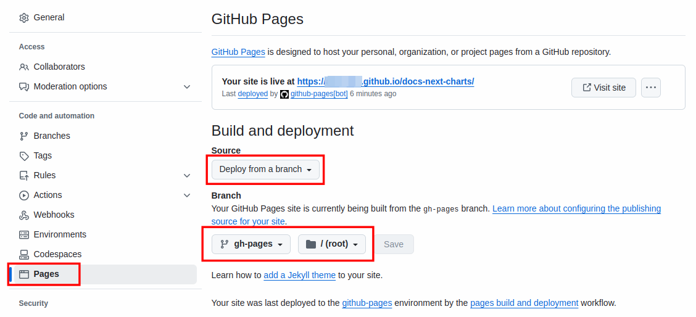
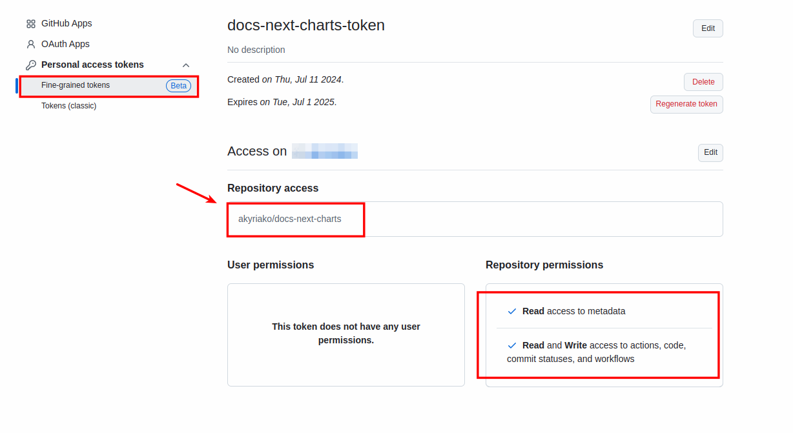
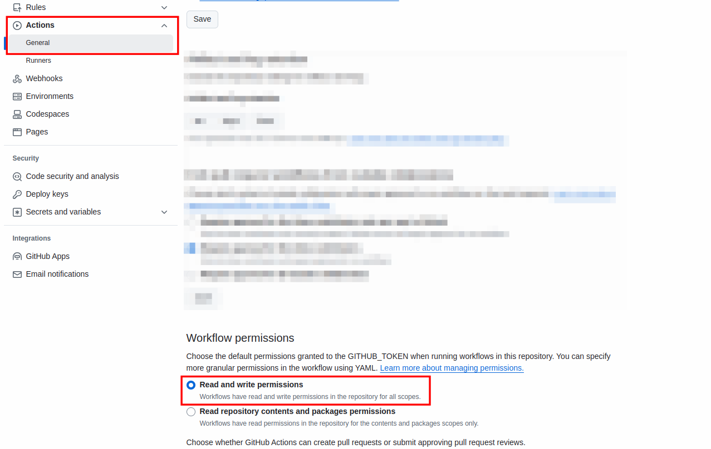

# GitHub Environments Configuration

You need to configure 4 GitHub environments:

- **preview**: for staging
- **stable**: for production
- **pull-requests-preview**: for ephemeral deployments for PR reviews
- **gh-pages**: for GitHub pages publishing and deployment

## GitHub Pages

Create a new branch, `gh-pages`, and go to *Settings* -> *Pages* of the repository:  

Choose **Deploy from a branch** as *Source*, and as *Branch* **gh-pages/root**.

> [!IMPORTANT]
> Do this for **both** repositories, **docs-next** and **docs-next-chart**!

## Helm Charts Repository Token Configuration (docs-next-charts)

Go to *Account* -> *Settings* -> *Developer Settings* -> *Personal Access Tokens* -> *Fine-grained tokens* and click *Generate new token*. Create a new token with the name **docs-next-charts-token** and give to it access to the repository: **docs-next-charts**. Assign the following permissions to the token:

- **Read access to metadata**
- **Read and Write access to actions, code, commit statuses, and workflows**

> [!IMPORTANT]
>Save the value of the token, you are going to set it afterwards as the value of the secret `DOCS_NEXT_CHARTS_TOKEN`.

## Code Repository Configuration (docs-next)

### Workflow Permissions

Go to *Settings* -> *Actions* -> *General* of the repository and choose **Read and write permissions** as *Workflow Permissions*. Click *Save* to persist changes:

### Variables

| Variable               |     pull-requests-preview      |      preview       |       stable       | Default/Description        |
| :--------------------- | :----------------------------: | :----------------: | :----------------: | :------------------------- |
| APP_VERSION            |               1️⃣               |         1️⃣         |         1️⃣         | `0.1`                      |
| IMG_NAME               |               ❌               |    `docs-next`     |    `docs-next`     | Docker Image Name          |
| DOCS_NEXT_ORG          |               1️⃣               |         1️⃣         |         1️⃣         | GitHub Org Name            |
| DOCS_NEXT_REPO         |               ❌               |    `docs-next`     |    `docs-next`     | GitHub Repo Name           |
| DOCS_NEXT_HOST         |   `$DOCS_NEXT_ORG`.github.io   |         ✅         |         ✅         | Domain name                |
| DOCS_NEXT_CHARTS_ORG   |               ❌               |         1️⃣         |         1️⃣         | GitHub Org Name            |
| DOCS_NEXT_CHARTS_REPO  |               ❌               | `docs-next-charts` | `docs-next-charts` | GitHub Repo Name           |
| DOCUSAURUS_BASE_URL    |    `/docs-next/pr-preview/`    |         ❌         |         ❌         | Docusaurus `baseUrl`       |
| TYPESENSE_HOST         |               ❌               |         ✅         |         ✅         | Domain name                |
| TYPESENSE_PROTOCOL     |               ❌               |         ✅         |         ✅         | `https`                    |
| TYPESENSE_PORT         |               ❌               |         ✅         |         ✅         | `443`                      |
| UMAMI_ANALYTICS_DOMAIN |     `analytics.example.de`     |         ✅         |         ✅         | Domain name                |
| UMAMI_DATAHOST_URL     | `https://analytics.example.de` |         ✅         |         ✅         | Umami URL                  |
| UMAMI_DATA_DOMAINS     |               ✅               | `$DOCS_NEXT_HOST`  | `$DOCS_NEXT_HOST`  | Umami Allowed CORS Domains |
| UMAMI_WEBSITE_ID       |            `00000`             |         ✅         |         ✅         | Umami WebSite ID           |

> [!NOTE]
> ✅ : Yes,
> 1️⃣ : Yes but horizontally identical value, 
> ❌ : No,
> 
> Otherwise use the default value or the one dictated per environment.

### Secrets

| Secret                 | pull-requests-preview | preview | stable | Default/Description                |
| :--------------------- | :-------------------: | :-----: | :----: | :--------------------------------- |
| DOCKERHUB_USERNAME     |          ❌           |   ✅    |   ✅   | Container Registry User            |
| DOCKERHUB_TOKEN        |          ❌           |   ✅    |   ✅   | Container Registry Access Token    |
| DOCS_NEXT_CHARTS_TOKEN |          ❌           |   1️⃣    |   1️⃣   | DOCS_NEXT_CHARTS_REPO Access Token |
| TYPESENSE_API_KEY      |          ❌           |   ✅    |   ✅   | TypeSense Admin API Key            |
| TYPESENSE_SEARCH_KEY   |          ❌           |   ✅    |   ✅   | TypeSense Search API Key           |

> [!NOTE]
> ✅ : Yes,
> 1️⃣ : Yes but horizontally identical value,
> ❌ : No

